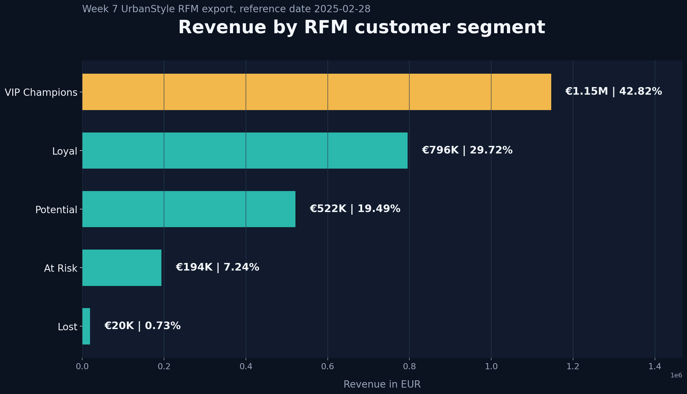

# Ragnar Laak - Data Analytics Portfolio

Junior BI / Data Analyst portfolio with SQL, Power BI, Python/pandas, PostgreSQL/Supabase and business reporting projects.

Live website: https://ragnarlaak.github.io/

Projects are based on an UrbanStyle retail business-simulation dataset completed during the Data Analyst Career Accelerator: A Hands-On Mentorship Program at Ettevotluskeskus.

## Focus

I turn business data into clear insights, dashboards and practical recommendations through SQL, Power BI and Python/pandas. This portfolio shows practical work in data quality, dashboard reporting, customer segmentation and repeatable Python reporting workflows.

Target roles: Data Analyst, BI Analyst, Reporting Analyst, Data Quality / Reporting roles and related analyst roles across industries.

## Tools

SQL · Power BI · Python/pandas · PostgreSQL/Supabase · Business Reporting

## Featured Case Studies

### Power BI - Sales Performance Dashboard

**Business question:** How did UrbanStyle perform, and where is growth lagging?

**Evidence status:** DOCUMENTED EVIDENCE, NOT REPRODUCED

**Business answer:** UrbanStyle grew overall, with 2024 revenue 19.08% higher than 2023 in the documented dashboard view. Tartu also grew, but below the company growth rate, making it the location to investigate next.

Documented Week 5 and Week 6 evidence supports:

- ~EUR 2.91M revenue analysed.
- ~10K orders.
- 19.08% revenue growth in 2024 versus 2023.
- ~13% Tartu growth, below overall company growth.

**Business action:** Compare Tartu product mix, average order value and customer segments with stronger-performing locations or channels.

Evidence:

- [Week 5 Power BI dashboard](week5-power-bi/README.md)
- [Week 6 Tartu storytelling dashboard](week6-data-storytelling/README.md)
- [Power BI manual improvement checklist](portfolio-evidence/powerbi-manual-improvement-checklist.md)

### Python/pandas - RFM Customer Segmentation

**Business question:** Which customer groups should UrbanStyle prioritise for loyalty, repeat-purchase and win-back actions?

**Evidence status:** VERIFIED / REPRODUCED FROM COMMITTED WEEK 7 TEAM EXPORT

**Result:** Analysed 2,540 customers through the Week 7 team RFM workflow. VIP Champions included 455 customers and contributed 42.82% of monetary value, while 758 Potential customers and 533 At Risk customers indicated clear repeat-purchase and retention opportunities.

**Team context:** This was a team project based on the UrbanStyle course/business-simulation dataset. My contribution focused on calculating Recency, Frequency and Monetary values, assigning segments and checking that the segmentation logic supported the business objective.

**Verified findings:**

- 2,540 customers analysed using reference date 2025-02-28.
- 455 VIP Champions generated 42.82% of monetary value.
- 758 Potential customers represent repeat-purchase opportunity.
- 533 At Risk customers represent retention/win-back priority.

**Business action:** Protect high-value VIP customers, encourage repeat purchases among Potential customers and target At Risk customers with retention or win-back actions.

Evidence:

- [Week 7 RFM project](week7-python/README.md)
- [Authoritative RFM verification](portfolio-evidence/outputs/authoritative-rfm/rfm_authoritative_verification.md)
- [Authoritative RFM segment summary](portfolio-evidence/outputs/authoritative-rfm/rfm_authoritative_segment_summary.csv)
- [RFM revenue chart](portfolio-evidence/outputs/authoritative-rfm/rfm_authoritative_revenue_by_segment.png)

### SQL - Data Quality Analysis

**Business question:** Is customer data reliable enough for reporting and segmentation?

**Evidence status:** DOCUMENTED EVIDENCE, NOT REPRODUCED

**Business answer:** Customer data needs cleaning before it is fully reliable for segmentation and reporting because duplicate emails, missing emails and inconsistent city values can distort analysis.

Week 2 evidence supports:

- 128 duplicate email records.
- 380 missing email values.
- 12 city naming variations.

**Business impact:** These issues can reduce reporting reliability and weaken customer segmentation or location-based analysis.

**Business action:** Standardise location values, resolve duplicate records and strengthen required-field validation before reporting or campaign use.

Evidence:

- [Week 2 SQL data cleaning](week2-sql-data-cleaning/README.md)
- [Week 2 team SQL file](week2-sql-data-cleaning/team/week2_group_project.sql)

### Python Pipeline - Workflow Evidence

**Business question:** How can recurring customer and sales analysis be refreshed without manually repeating notebook work?

**Evidence status:** VERIFIED / REPRODUCED FOR SAMPLE/FALLBACK WORKFLOW

**Business answer:** A modular Python pipeline can make recurring extract, transform, validate and export steps repeatable instead of depending on manual notebook reruns.

Week 8 checks confirmed:

- 4/4 tests passed.
- Pipeline completed with configured sample/fallback data.
- Core outputs validated.
- 24 HTML reports exported in the local run.

**Business action:** Use this project as workflow evidence for repeatable reporting automation. The Week 8 demonstration is not live UrbanStyle KPI evidence.

Evidence:

- [Week 8 Python API pipeline](week8-python-api-pipeline/README.md)
- [Week 8 team pipeline](week8-python-api-pipeline/team/README.md)

## Evidence Package

The audit package in [portfolio-evidence](portfolio-evidence/) records which claims were reproduced, which are documented but not independently rerun, and which remain blocked by data or credential access.

Key files:

- [Verified findings](portfolio-evidence/verified-findings.md)
- [Verification log](portfolio-evidence/verification-log.md)
- [Website content package](portfolio-evidence/website-content.md)
- [Power BI manual improvement checklist](portfolio-evidence/powerbi-manual-improvement-checklist.md)

## Portfolio Map

| Week | Topic | Evidence |
| --- | --- | --- |
| Week 0 | Portfolio setup and team collaboration | [Open](week0-portfolio-setup/README.md) |
| Week 1 | SQL basics and sales exploration | [Open](week1-sql-basics/README.md) |
| Week 2 | SQL data cleaning and customer data quality | [Open](week2-sql-data-cleaning/README.md) |
| Week 3 | SQL joins and inventory analysis | [Open](week3-sql-joins/README.md) |
| Week 4 | SQL aggregation and business KPIs | [Open](week4-sql-aggregation/README.md) |
| Week 5 | Power BI dashboard | [Open](week5-power-bi/README.md) |
| Week 6 | Data storytelling and Tartu store view | [Open](week6-data-storytelling/README.md) |
| Week 7 | Python/pandas and RFM segmentation | [Open](week7-python/README.md) |
| Week 8 | Python API pipeline | [Open](week8-python-api-pipeline/README.md) |

## Course Context

This portfolio was developed during the Data Analyst Career Accelerator: A Hands-On Mentorship Program at Ettevotluskeskus, March 2026 to June 2026. The work focuses on SQL, PostgreSQL/Supabase, Power BI, Python/pandas, data quality, business reporting, dashboard storytelling and GitHub-based portfolio documentation.

No certificate claim is made here unless certificate evidence is added later.

## Responsible AI Use

AI tools supported debugging, documentation structure, visual review and portfolio refinement. Reported findings were tied back to executed analysis or clearly documented project evidence, and business interpretation remained my responsibility.

## Contact

- GitHub: [ragnarlaak](https://github.com/ragnarlaak)
- Website: [ragnarlaak.github.io](https://ragnarlaak.github.io/)
- LinkedIn: [Ragnar Laak](https://www.linkedin.com/in/ragnar-laak-612249230/)
- Email: ragnarlaak@gmail.com
