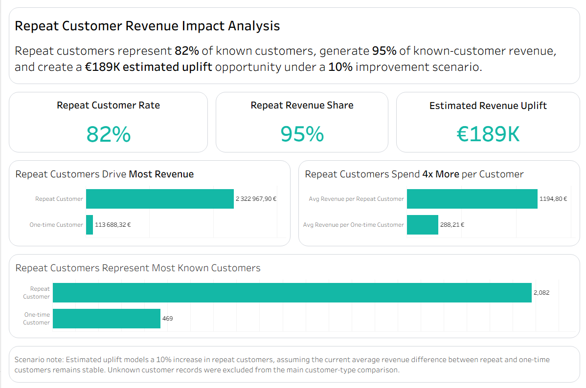

# Repeat Customer Revenue Impact Analysis

## Short summary

Built a Tableau dashboard analyzing how repeat customers contribute to revenue compared with one-time customers. The dashboard shows that repeat customers represent 82% of known customers, generate 95% of known-customer revenue, spend around 4x more per customer, and create an estimated EUR 188.8K uplift opportunity under a 10% repeat-customer improvement scenario.

## Business question

How much revenue value comes from repeat customers, and what could a 10% repeat-customer improvement be worth?

## Tools used

- Tableau
- Customer analytics
- Repeat customer analysis
- Revenue impact scenario
- Business dashboarding
- Data storytelling

## Dashboard screenshot

Image path for the dashboard screenshot:

`assets/images/repeat_customer_revenue_impact_tableau.png`

## Key insights

- Repeat customers are the main revenue engine.
- Repeat customers represent 82% of known customers.
- Repeat customers generate 95% of known-customer revenue.
- Repeat customers spend roughly 4x more per customer than one-time customers.
- Increasing repeat customers by 10% could create an estimated EUR 188.8K revenue uplift, assuming current customer value patterns remain stable.
- Unknown customer records were excluded from the main comparison to keep the analysis focused on identifiable customer behavior.

## Scenario method

I classified customers as one-time or repeat based on distinct order count. Then I compared average revenue per customer between those groups. The uplift scenario estimates additional repeat customers from a 10% improvement and multiplies that by the revenue difference between repeat and one-time customers.

This is a simple business scenario, not a predictive forecast. It assumes the current average revenue difference between repeat and one-time customers remains stable.

## Business recommendation

Focus retention efforts on converting more one-time customers into repeat customers, because repeat customers generate significantly higher average revenue and dominate known-customer revenue.

## Data quality note

Unknown customer records were excluded from the main customer-type comparison. This keeps the analysis focused on identifiable customer behavior and avoids mixing known customer patterns with records that cannot be reliably classified as one-time or repeat customers.

## What I demonstrated

- Tableau dashboard building
- KPI design
- Customer revenue analysis
- Scenario modeling
- Business storytelling
- Data quality awareness
- Translating analysis into a business recommendation
