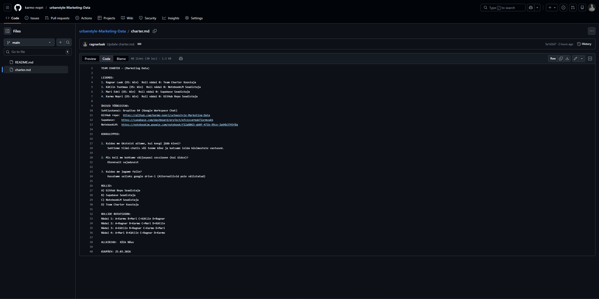
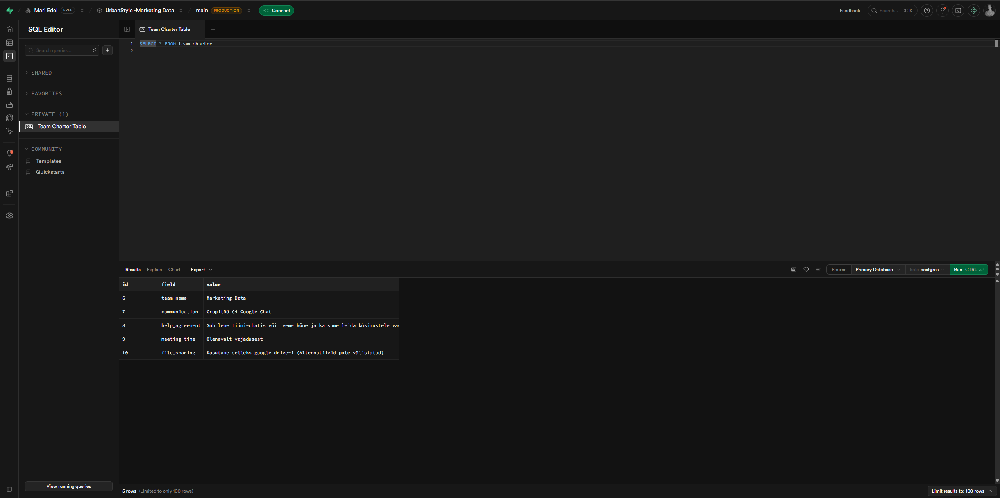
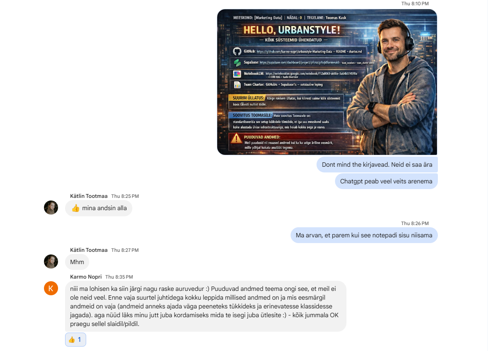

# Week 0 – Setup and First Collaboration

## Focus
Week 0 focused on onboarding, team setup, shared tools, and the first collaborative tasks in the project.

## My contribution
- Completed the Team Charter section
- Helped organize the GitHub and Supabase onboarding work
- Participated actively in group coordination
- Took responsibility for preparing the shared onboarding slide/document when needed
- Created and shared a first draft of the team output for review
- Began documenting my own progress in my personal repository

## Tools used
- GitHub
- Supabase
- Google Workspace Chat
- NotebookLM
- ChatGPT

## Evidence

### GitHub Team Charter

### Supabase Charter Table

### Group Presentation Slide

### Shared output draft

## What I learned
- Early project structure strongly affects collaboration
- Clear ownership helps group work move faster
- Personal documentation is important for showing individual contribution
- Shared setup work is part of the project foundation, not just admin work
- Keeping screenshots and weekly notes will make interview preparation easier later

## Reflection
Week 0 was mainly about building the foundation for the project. In addition to Team Charter work, I contributed to the shared onboarding output and helped move the setup forward. This week reinforced the importance of communication, documentation, and keeping a clear personal record of contribution in group-based work.
