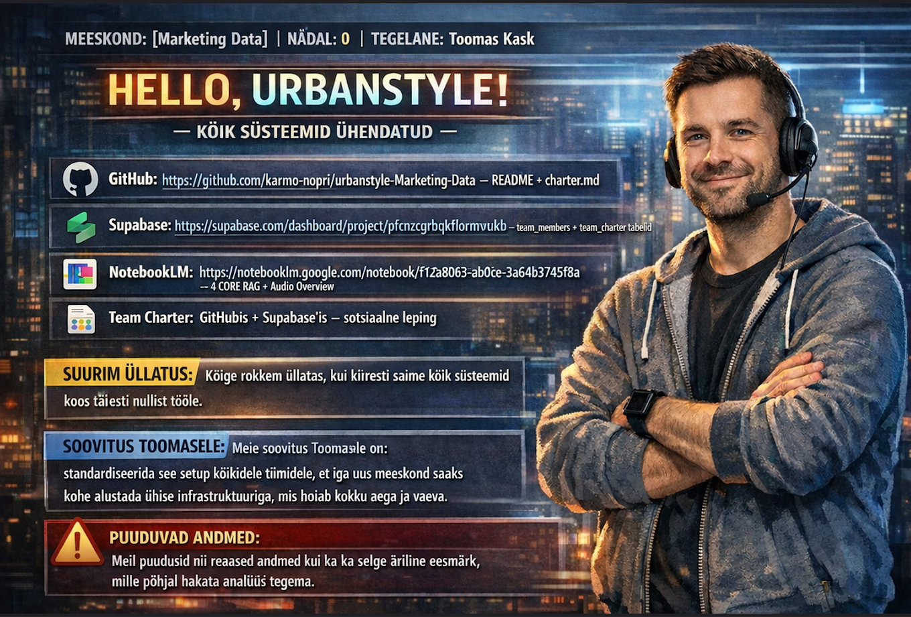

# Week 0 - Setup and First Collaboration

## Focus

Week 0 was about onboarding, setting up shared tools, and getting the team collaboration workflow started.

## My Contribution

- Completed the Team Charter section
- Helped organize GitHub and Supabase onboarding tasks
- Participated actively in group coordination
- Prepared part of the shared onboarding slide output
- Created and shared an early draft for review
- Started documenting my own weekly contribution in this portfolio

## Tools Used

- GitHub
- Supabase
- Google Workspace Chat
- NotebookLM
- ChatGPT

## Evidence

### GitHub Team Charter

### Supabase Charter Table

### Group Presentation Slide

### Shared Output Draft

## What I Learned

- Early project structure has a big impact on collaboration
- Clear ownership helps group work move faster
- Personal documentation is important for showing individual contribution
- Shared setup work is part of the project foundation, not just admin work
- Keeping weekly notes and screenshots will make later portfolio work easier

## Reflection

Week 0 was mainly about building the foundation for the rest of the program. Alongside the Team Charter work, I contributed to the first shared team output and helped move the setup process forward. This week reinforced how important communication, structure, and documentation are in collaborative work.
